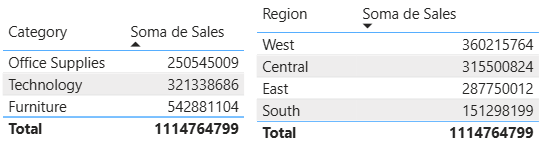
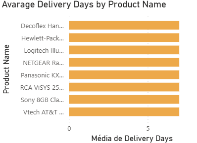
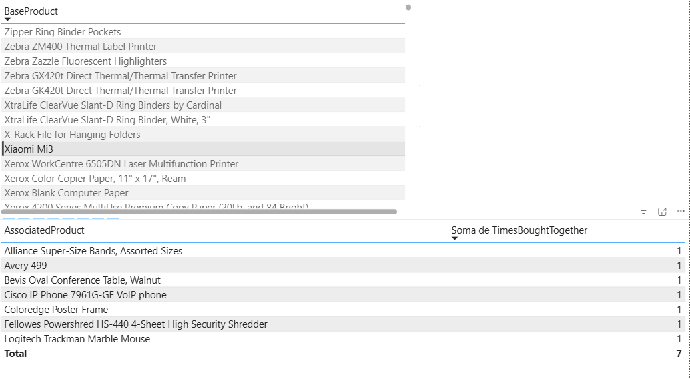

# Sales Data Analysis with Power BI

Power BI is a tool developed by Microsoft whose main purpose is to transform raw data into visual and interactive information quickly and easily, enabling Business Intelligence (BI) analyses in a simple, dynamic, and intuitive way.
It allows users to connect to multiple data sources, create custom dashboards and reports, and share insights in real time, supporting managers and analysts in data-driven decision-making.
For this project, we used the Superstore Sales dataset obtained from Kaggle, which can be downloaded [here](sources/Sales_Store.csv).

## Introduction – Visualizations

With the data properly loaded, the first visualization created was sales by product, which allows us to identify which items have the highest sales volume.
Although this information may seem relatively simple at first glance, it can provide highly valuable strategic insights.

For instance, analyzing the top-selling products can reveal consumer trends, help define optimal inventory levels, guide targeted marketing campaigns, and identify opportunities to increase profit margins by prioritizing better-performing items.
Moreover, by combining these data with other variables — such as region, time period, category, or customer profile — it becomes possible to gain a deeper understanding of market behavior, supporting more accurate planning and sales management decisions.

In the same way, visualizations of sales by category and sales by region were developed.
The first provides a strategic view of the product segments that have the greatest impact on total revenue, allowing the identification of which categories deserve greater investment, repositioning, or specific promotional actions.

The regional sales analysis, on the other hand, enables the comparison of geographical performance, highlighting areas with higher order volumes, greater profitability, or higher logistical costs.
This visualization also helps assess factors related to shipping and distribution, such as delivery time, transportation costs, and local inventory availability.

## SHIPPING TIME

By creating shipping time charts categorized by delivery type, we obtained a broader view of delivery times and the logistics methods used. Power BI enables dynamic interaction between the different visuals, allowing variables to be easily correlated.
When comparing the best-selling products with their shipping modes and times, it is observed that items with higher demand tend to be dispatched through faster transportation methods, likely due to the operational priority given to high-turnover products.

For example, the Riverside Palais Royal Lawyer Bookcase was mostly shipped via the “Second Class” mode, while the Atlantic Metals Mobile 5 Shelf Bookcase—the second best-selling product—was predominantly shipped through “First Class” delivery.

A possible explanation for this behavior is that these products are often purchased by companies and offices that prefer faster transportation options to reduce waiting time and increase productivity.

 

We also created an interactive filter to identify which products have shipping times above the average.
Knowing that the overall average shipping time—considering all categories—is approximately four days, we specifically filtered the products whose delivery time exceeds this value, as illustrated in the chart below.

The results show that these products were mostly shipped via the “Standard Class” mode, with an average of seven days between the purchase date and the actual dispatch.
A relevant observation is that, except for the Decoflex Hanging Personal Folder, all items in this group belong to the “Technology” category.

Thus, a plausible hypothesis for the longer shipping times of these products may be linked to logistical and operational factors specific to the technology segment. These items might require more careful handling, stock verification across different distribution centers, or even additional security and quality checks before dispatch.
Furthermore, dependence on external suppliers and longer restocking times may also contribute to this difference, directly impacting the average delivery time compared to products in other categories.

## INTELLIGENT RECOMMENDATION

Finally, we created in our dashboard a system for checking products purchased together, with the goal of identifying consumption patterns and associations between items.
This system consists of two interactive tables, developed using DAX expressions in Power BI, which apply dynamic filters to display which products each customer has purchased and how often these products appear in the purchases of other customers.
You can check the code used to create these tables here
.

This way, it is possible to determine how many customers who bought product A also purchased product B, revealing relationships between items.
This type of analysis is extremely valuable for marketing and sales strategies, as it allows the identification of products with high cross-selling potential and frequently purchased item combinations.

For example, as shown in the image below, by selecting the product Xiaomi Mi3 in Table 1, we can visualize which other products were commonly purchased by customers along with it.

## CONCLUSION

The development of this Power BI dashboard enabled a comprehensive and interactive analysis of sales data, allowing for a deeper understanding of product behavior, customer patterns, and logistical processes.
Through the various visualizations, it was possible to identify top-selling items, assess performance by category and region, and correlate shipping time and type with product demand.

The analyses also revealed specific logistical patterns, such as the longer delivery times for products in the Technology category, as well as recurrent purchase relationships between different items—creating opportunities for cross-selling strategies and operational improvements.

Overall, the project demonstrates how Power BI can serve as a powerful decision-support tool, transforming raw data into strategic and actionable insights that can guide business policies, optimize processes, and enhance the customer experience.
