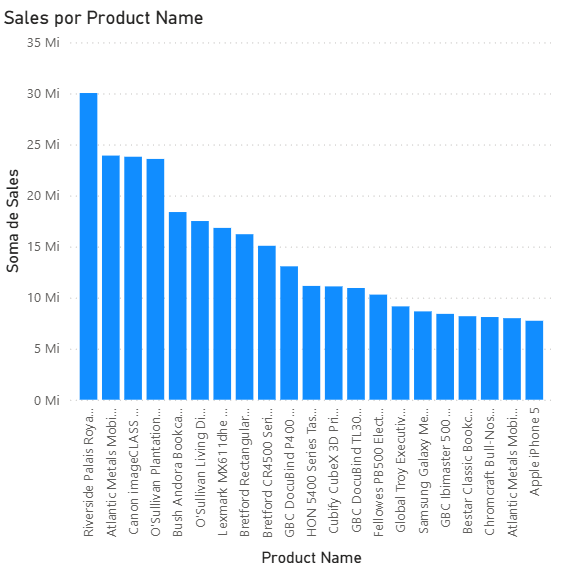
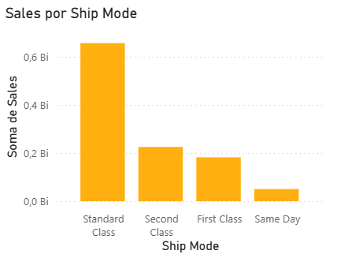

# Análise de dados de vendas com Power BI

O Power BI é uma ferramenta desenvolvida pela Microsoft cuja principal função é transformar dados brutos em informações visuais e interativas de forma ágil e fácil, permitindo análises de negócios (Business Intelligence) de forma simples, dinâmica e intuitiva.
Ele possibilita conectar diferentes fontes de dados, criar dashboards e relatórios personalizados, e compartilhar insights em tempo real, auxiliando gestores e analistas na tomada de decisões baseada em dados (data-driven decision making).
Para esse projeto, utilizamos a base de dados de vendas 'superstore' adquirida através do site Kaggle e que pode ser baixada [aqui](project6/sources/superstore.csv).

## INTRODUÇÃO - VISUALIZAÇÕES 

Com os dados devidamente carregados, a primeira visualização elaborada foi a de vendas por produto, a qual nos permite identificar quais itens apresentam maior volume de comercialização. 
Embora essa informação pareça, à primeira vista, relativamente simples, ela pode fornecer insights estratégicos bastante valiosos.

Por exemplo, a análise dos produtos mais vendidos pode indicar tendências de consumo, auxiliar na definição de estoques ideais, orientar campanhas de marketing direcionadas e identificar oportunidades de aumento de margem por meio da priorização de itens com melhor desempenho. Além disso, ao cruzar esses dados com outras variáveis, como região, período, categoria ou perfil de cliente, é possível obter uma compreensão mais profunda do comportamento do mercado, apoiando decisões de planejamento e gestão comercial mais assertivas.

Do mesmo modo, foram desenvolvidas visualizações de vendas por categoria e vendas por região. A primeira oferece uma visão estratégica dos segmentos de produtos que exercem maior influência sobre o faturamento total, permitindo identificar quais categorias merecem maior investimento, reposicionamento ou ações promocionais específicas.

Já a análise por região possibilita comparar o desempenho geográfico das vendas, destacando áreas com maior volume de pedidos, maior rentabilidade ou maior custo logístico. Essa tabela também auxilia na avaliação de questões relacionadas ao envio e distribuição, como tempo de entrega, custos de transporte e disponibilidade de estoque local.

## TEMPO DE ENVIO

Ao criarmos os gráficos de tempo de envio categorizados por tipo, obtivemos uma visão mais abrangente sobre os prazos de entrega e os meios logísticos utilizados. O Power BI possibilita uma interação dinâmica entre os diferentes gráficos, permitindo correlacionar facilmente as variáveis. Ao compararmos os produtos mais vendidos com os modos e tempos de envio, observa-se que os itens de maior demanda tendem a ser despachados por meios de transporte mais rápidos, possivelmente em função da prioridade operacional dada aos produtos de alta rotatividade.

Por exemplo, o Riverside Palais Royal Lawyer Bookcase foi enviado majoritariamente pelo modo “Second Class”, enquanto o Atlantic Metals Mobile 5 Shelf Bookcase, segundo produto mais vendido, apresentou predominância no envio via “First Class”.

Uma provável hipótese para esse comportamento é que esses produtos sejam vendidos para empresas e escritórios que buscam otimizar modos de transporte mais ágeis para reduzir o tempo de espera e aumentar a produtividade.

  

Também criamos um filtro interativo para identificar quais produtos apresentam tempo de envio acima da média. Sabendo que o tempo médio geral de envio, considerando todas as categorias, é de aproximadamente quatro dias, filtramos especificamente os produtos cujo tempo de entrega supera esse valor, conforme ilustrado no gráfico abaixo.

Os resultados mostram que esses produtos foram enviados majoritariamente pelo modo “Standard Class”, apresentando um tempo médio de sete dias entre a data da compra e o despacho efetivo. Um ponto relevante é que, com exceção do Decoflex Hanging Personal Folder, todos os itens que compõem esse grupo pertencem à categoria “Technology”.

Dessa forma, uma hipótese plausível para o maior tempo de envio desses produtos está relacionada a fatores logísticos e operacionais específicos do segmento tecnológico. Esses itens podem demandar maior cuidado no manuseio, verificação de estoque em centros de distribuição distintos, ou ainda processos adicionais de conferência e segurança antes do despacho. Além disso, a dependência de fornecedores externos e prazos de reposição mais longos pode contribuir para essa diferença, impactando diretamente o tempo médio de envio quando comparado a produtos de outras categorias.

## RECOMENDAÇÃO INTELIGENTE

Por fim, criamos em nosso dashboard um sistema de verificação de produtos comprados em conjunto, com o objetivo de identificar padrões de consumo e associações entre itens. Esse sistema é composto por duas tabelas interativas, desenvolvidas por meio de expressões DAX no Power BI, que aplicam filtros dinâmicos para exibir quais produtos cada cliente adquiriu e com que frequência esses produtos aparecem nas compras de outros clientes. Você pode conferir o código usado para criação das tabelas [aqui](sources/codes.md).

Dessa forma, é possível verificar quantos clientes que compraram o produto A também adquiriram o produto B, revelando relações entre os itens. Essa análise é extremamente útil para estratégias de marketing e vendas, permitindo identificar produtos com alto potencial de venda cruzada (cross-selling) e combinações de itens frequentemente compradas em conjunto.

Por exemplo, conforme a imagem abaixo, eu consigo, ao selecionar o produto Xiaomi Mi3 na tabela 1, visualizar quais produtos foram comprados por clientes juntamente com ele.

## CONCLUSÃO

O desenvolvimento deste dashboard no Power BI possibilitou uma análise abrangente e interativa das vendas, permitindo compreender com maior profundidade o comportamento dos produtos, clientes e processos logísticos. Através das diferentes visualizações, foi possível identificar os itens mais vendidos, avaliar o desempenho por categoria e região, e correlacionar o tempo e o tipo de envio com a demanda dos produtos.

As análises também evidenciaram padrões logísticos específicos, como o maior tempo de entrega em produtos da categoria Technology, e relações de compra recorrentes entre diferentes itens, o que abre espaço para estratégias de venda cruzada e melhoria operacional.

De forma geral, o projeto demonstra como o Power BI pode ser uma ferramenta poderosa de apoio à tomada de decisão, convertendo dados brutos em insights estratégicos e acionáveis que podem orientar políticas comerciais, otimizar processos e aprimorar a experiência do cliente.

